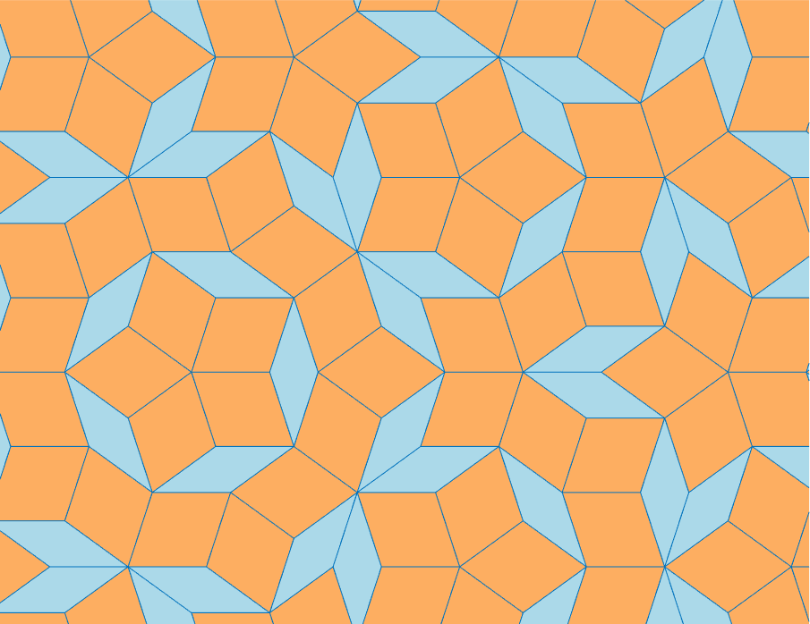

# Penrose Rhombus Tiling

This repository contains MATLAB functions for visualizing a type of Penrose tiling. Penrose tilings are non-periodic and self-similar. The particular tiling implemented here, called P3, is constructed from a pair of rhombuses, a thin one and a thick one.

Copyright 2019 The MathWorks, Inc.